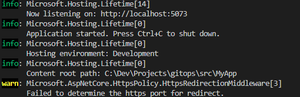
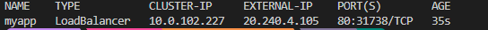
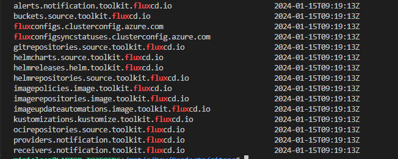

# Guide to to automate image updates with FluxCD on AKS

The intended workflow:

1. Create the application
2. Test locally
3. Commit and push to GitHub
4. push image to Azure Container Registry
5. Deploy aks
6. Deploy FluxCD
7. Kustomize the manifests

## Introduction

This guide will help you to use FluxCD to deploy your application to AKS cluster.

## Prerequisites

- [Azure CLI](https://docs.microsoft.com/en-us/cli/azure/install-azure-cli?view=azure-cli-latest)
- [kubectl](https://kubernetes.io/docs/tasks/tools/install-kubectl/)
- [GitHub Account](https://github.com/)
- [Flux CLI](https://fluxcd.io/docs/installation/#install-the-flux-cli)
- [Kustomize](https://kubectl.docs.kubernetes.io/installation/kustomize/)

## Create the application

Create a `src` directory and use dotnet new to create blazor server app.

```bash
mkdir src
cd src
dotnet new blazorserver -o MyApp
```

Navigate to the app directory and run the app

```bash
cd MyApp
dotnet run
```

You should see the app running on http://localhost:7230



Navigate to root and use dotnet new to create a new solution file.

```bash
cd ..
dotnet new sln 
```

Add MyApp to the solution

```bash
dotnet sln add src/MyApp/MyApp.csproj
```

Create a dockerfile for the app

## Create an Azure Container Registry

```bash
$rgName="ffi-rg"
$aksClusterName="ffi-aks"
$location="swedencentral"
$acrName="ffiacr"
```

Create a resource group for the Azure Container Registry and create the Azure Container Registry.

```bash
az group create --name $rgName --location $location
az acr create --resource-group $rgName --name $acrName --sku Basic
```

Build and push the image to the Azure Container Registry.

```bash
az acr build --registry $acrName -t myapp:v1 -f ./src/MyApp/dockerfile .
```

## Create AKS Cluster

Create AKS cluster using Azure CLI and attach the Azure Container Registry to the AKS cluster.

```bash

```

Get AKS cluster credentials

```bash
az aks get-credentials --resource-group $rgName --name $aksClusterName
```

Get your login server address using the az acr list command and query for your login server.

```bash
az acr list --resource-group $rgName --query "[].{acrLoginServer:loginServer}" --output table
```

Set the image property for the containers in the manifests/myapp.yaml file.

Deploy the app to AKS cluster

```bash
kubectl apply -f manifests/myapp.yaml
```

Test the app

```bash
kubectl get svc myapp
```

The output should look like this:



## Install the FluxCD AKS extension

AKS extensions are Microsoft-maintained packages that can be installed using Azure Resource Manager to enable additional functionality on your AKS cluster. In a way, AKS extensions are like AKS add-ons. However, AKS extensions are offered via a different Azure resource provider and therefore offers the flexibility to be installed on a variety of Kubernetes clusters including Azure Arc enabled Kubernetes clusters. Take a look at this article by @JorgeArteiro for more information on the differences between AKS extensions and AKS add-ons.

## Install Azure CLI extensions

```bash
# enable new features for aks
az extension add --name aks-preview

# enable aks extension installations
az extension add --name k8s-extension

# enable aks extension configuration
az extension add --name k8s-configuration
```

## Install FluxCD

```bash
az k8s-extension create --cluster-name $aksClusterName --resource-group $rgName --cluster-type managedClusters --extension-type microsoft.flux --name myapp
```

This command will install the FluxCD AKS extension on your AKS cluster. It is equivalent to running the flux install Flux CLI command.

The first parameters are self-explanatory... we are using Azure Resource Manager to install the extension so you need to pass in the AKS cluster name and resource group.

The parameters you need to be aware of here are `--cluster-type` and `--extension-type`. You need to specify `managedClusters` and `microsoft.flux` respectively which tells the Azure resource provider that you are installing the FluxCD extension on a managed AKS cluster. Getting these last parameters wrong will result in an error.

With the extension installed, you can run the following Flux CLI command to get the status of the installation.

```bash
flux check --pre
```

Flux installs many new Custom Resource Definitions (CRDs) in the cluster. These CRDs are how you interact with FluxCD. You can run the following command to see all the new CRDs.

```bash
kubectl get crds | grep flux
```




## Prepare Kubernetes manifests for Kustomize

A successful GitOps implementation hinges on how well you structure your Git repository and how well you manage processes and workflows. GitOps tools are just that; they're tools, you need to do some work up front like determining file structure, branching strategy, branch protections, and workflows to ensure that you are setting yourself up for success.

### "Kustomizing" manifests

[Kustomize](https://kubectl.docs.kubernetes.io/installation/kustomize/) is not a templating engine like Helm, it is more like a patching engine. It allows you to create a base set of Kubernetes manifests and then patch them with environment specific configurations. These environmental configurations are known as "overlays". So you can have a `dev` overlay, a `prod` overlay, a `staging` overlay, etc. and use them to patch the base manifests with environment specific configurations.

## Create a `dev` overlay

All of our manifests currently sit a the `manifests` directory so from here we can create overlays for different environments.

First we need to create our initial kusomtization.yaml file. This file will tell Kustomize where to find the base manifests and where to find the overlays.

Using the Kustomize CLI, run the following command to create the base kustomization.yaml file:

```bash
cd manifests

kustomize create --autodetect

# view the kustomization.yaml file
cat kustomization.yaml
```

Next, we need to create an overlay for our dev environment.

We need to navigate back to the root of the repo directory and create a dev overlay directory.

```bash
cd ../
mkdir -p overlays/dev
cd overlays/dev
```

We want our dev deployment to deploy to a new namespace so we'll create a new manifest to create one. Run the following command to create a new manifest file.

```bash
kubectl create namespace myapp-dev --dry-run=client -o yaml > namespace.yaml
```

Generate the kustomization.yaml file for our dev overlay using the following command.

```bash
kustomize create --resources namespace.yaml,./../../manifests --namespace myapp-dev

# view the kustomization.yaml file
cat kustomization.yaml
```

## Kustomize in action

Let's test the `dev` overlay by running the following command from the `dev` directory:

```bash
kustomize build 
```

Notice how all the manifests are patched with the `myapp-dev` namespace and output to the console. This is how Kustomize works. It patches the base manifests with environment specific configurations and outputs the patched manifests to the console.

To deploy these patched manifests, you would run a command like this.

```bash
kustomize build | kubectl apply -f -
```

Kustomize is also built into kubectl so you can run the following command to apply the manifests to your cluster.
  
  ```bash
  kubectl apply -k .
  ```

  Hopefully you didn't run the commands above. If you did, no problem you can delete this deployment with either of these commands.

  ```bash
  # using kustomize
kustomize build | kubectl delete -f -

# or using kubectl
kubectl delete -k .
  ```
